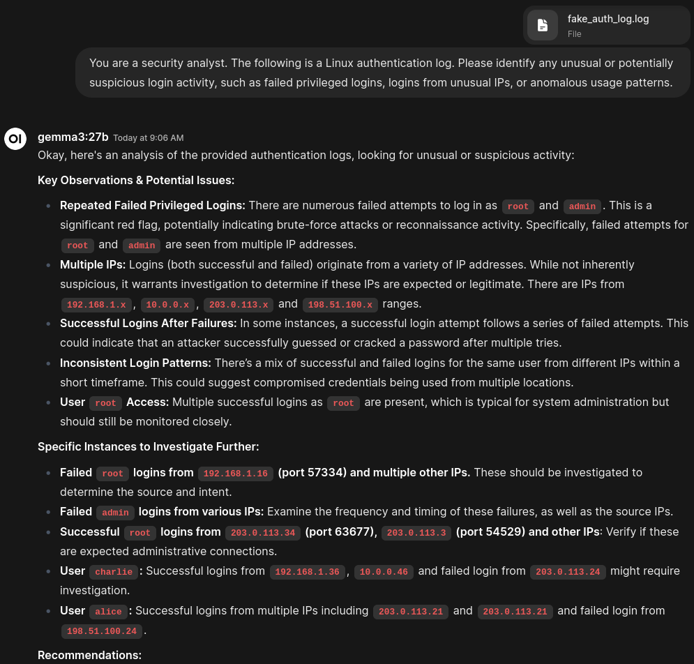

# Ollama + Open-WebUI Login Analysis
This readme will contain information to utilize Open-WebUI and Ollama for the purposes of analyzing login type data. 

## Steps
Follow these steps to begin your AI and cybersecurity journey. 
1. Navigate to your Open-WebUI instance and select `Workspace` in the upper left corner.
2. Select `Knowledge`.
3. Select the almost invisible plus sign (+) towards the upper right corner.
4. Enter the descriptions for `What you are working on` and `What are you trying to achieve` and select `Create Knowledge`.
5. Select the plus sign (+) in the upper right corner once more and select `Upload files`.
6. Navigate to your login data (or use the fake data generated within this repository [HERE](https://github.com/Matt-M-3/login-ai-analysis/blob/main/fake_auth_log.log)).
7. Select `New Chat` in the upper left corner, ensuring a model is also selected as well.

You are now ready to begin asking questions of your data. Try a prompt similar to the following:
```txt
You are a security analyst. The following is a Linux authentication log. Please identify any unusual or potentially suspicious login activity, such as failed privileged logins, logins from unusual IPs, or anomalous usage patterns.
```
Still within the chat prompt, press the pound sign (#) on your keyboard to bring up the `Knowledge` pop-up and select the document you just uploaded. Finally, send the message! You should see something along the lines of:

<div style="text-align: center;">
  
</div>

>Note: the data contained within `fake_auth_log.log` is completely simulated data.